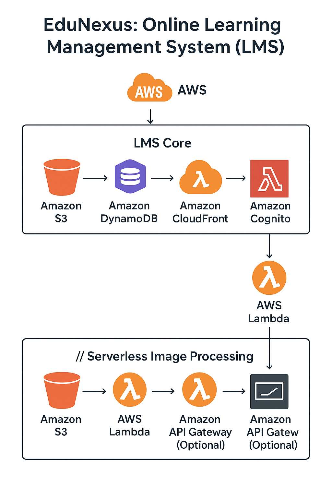

# EduNexus: Online Learning Management System (LMS)

## Project Overview
EduNexus is a modern, serverless LMS platform built with Angular and AWS. It enables instructors to upload course materials and students to track their progress. The system leverages AWS services for scalable, secure, and cost-efficient operations.

## Key Features
- **Course Management:** Instructors upload videos, PDFs, and assignments.
- **Student Progress Tracking:** Students view materials and track their learning journey.
- **Authentication:** AWS Cognito for secure login and role-based access (teachers/students).
- **Grading Automation:** AWS Lambda grades quizzes and updates progress.
- **Notifications:** AWS SES sends assignment deadlines and course updates.
- **Accelerated Streaming:** AWS CloudFront for fast video and file delivery.
- **Serverless Image Processing:** Users upload images to S3, Lambda processes (resize/watermark), stores in another S3 bucket.

## AWS Architecture
### LMS Core
- **Amazon S3:** Stores course videos, PDFs, assignments.
- **Amazon DynamoDB:** Stores course data, user profiles, progress.
- **Amazon CloudFront:** Accelerates video streaming and file access.
- **Amazon Cognito:** Manages authentication and user pools.
- **AWS Lambda:** Grades quizzes, updates progress, processes images.
- **Amazon SES:** Sends email notifications.

### Serverless Image Processing
- **Amazon S3:** Original images uploaded by users; processed images stored in a separate bucket.
- **AWS Lambda:** Triggered by S3 events, resizes and watermarks images.
- **Amazon API Gateway (Optional):** REST API for image uploads.
- **Amazon DynamoDB (Optional):** Stores metadata about images.
- **AWS Step Functions (Optional):** Orchestrates complex workflows.

## Project Modules
### 1. Auth Module
- User registration/login (Cognito)
- Role-based access (teacher/student)

### 2. Course Module
- Course creation/editing
- Material upload (S3 integration)
- Assignment management

### 3. Student Module
- Course enrollment
- Progress tracking (DynamoDB)
- Quiz participation

### 4. Instructor Module
- Upload materials
- View student progress
- Manage assignments/quizzes

### 5. Notification Module
- Email notifications (SES)
- Assignment deadlines
- Course updates

### 6. Image Processing Module
- Image upload (S3)
- Lambda processing (resize/watermark)
- Processed image storage (S3)
- Metadata management (DynamoDB)

## Deployment & Security
- **Serverless architecture:** Auto-scaling, pay-per-use.
- **IAM roles:** Secure access to AWS resources.
- **S3 bucket policies:** Restrict access to sensitive files.

## Learning Outcomes
- Build event-driven architectures with Lambda and S3 triggers.
- Understand cost-efficient, auto-scaling serverless applications.
- Enhance security using IAM roles and S3 bucket policies.

---
*Replace placeholder AWS resource names and endpoints with your actual configuration during deployment.*
